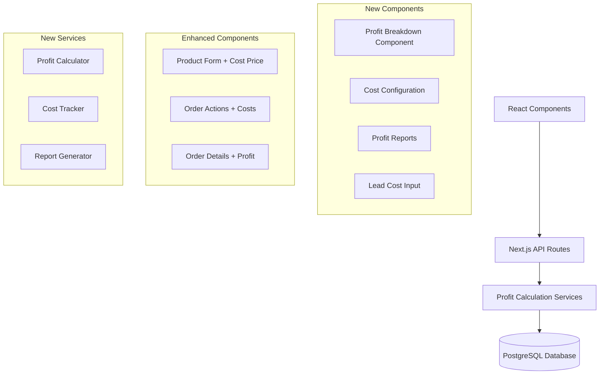

# Design Document

## Overview

The profit calculation system extends the existing e-commerce platform to provide comprehensive cost tracking and profit analysis. The system introduces new data models for cost tracking, enhances existing entities with cost fields, and provides calculation services and reporting interfaces.

The design follows the existing architecture patterns using Next.js API routes, Prisma ORM, and React components, ensuring seamless integration with the current multi-tenant system.

## Architecture

### High-Level Architecture



### Data Flow

1. **Cost Input Flow**: Users input costs at various stages (product creation, lead import, order processing)
2. **Calculation Flow**: System calculates profits when orders are created/updated
3. **Reporting Flow**: Aggregated profit data is generated for reports and analytics

## Components and Interfaces

### Database Schema Extensions

#### New Tables

**LeadBatch** - Tracks lead import batches with associated costs
```sql
model LeadBatch {
  id          String   @id @default(uuid())
  totalCost   Float    @default(0)
  leadCount   Int      @default(0)
  costPerLead Float    @default(0)
  importedAt  DateTime @default(now())
  tenantId    String
  userId      String
  leads       Lead[]
  tenant      Tenant   @relation(fields: [tenantId], references: [id])
  importedBy  User     @relation(fields: [userId], references: [id])
}
```

**OrderCosts** - Tracks all cost components for orders
```sql
model OrderCosts {
  id             String  @id @default(uuid())
  orderId        String  @unique
  productCost    Float   @default(0)
  leadCost       Float   @default(0)
  packagingCost  Float   @default(0)
  printingCost   Float   @default(0)
  returnCost     Float   @default(0)
  totalCosts     Float   @default(0)
  grossProfit    Float   @default(0)
  netProfit      Float   @default(0)
  profitMargin   Float   @default(0)
  order          Order   @relation(fields: [orderId], references: [id])
}
```

**TenantCostConfig** - Default cost configurations per tenant
```sql
model TenantCostConfig {
  id                    String  @id @default(uuid())
  tenantId              String  @unique
  defaultPackagingCost  Float   @default(0)
  defaultPrintingCost   Float   @default(0)
  defaultReturnCost     Float   @default(0)
  tenant                Tenant  @relation(fields: [tenantId], references: [id])
}
```

#### Enhanced Existing Tables

**Product** - Add cost price field
```sql
// Add to existing Product model
costPrice Float @default(0)
```

**Lead** - Add batch reference
```sql
// Add to existing Lead model
batchId   String?
batch     LeadBatch? @relation(fields: [batchId], references: [id])
```

### API Endpoints

#### New Endpoints

**Cost Configuration**
- `GET /api/tenant/cost-config` - Get tenant cost defaults
- `PUT /api/tenant/cost-config` - Update tenant cost defaults

**Lead Batch Management**
- `POST /api/leads/batch` - Create lead batch with costs
- `GET /api/leads/batch` - List lead batches
- `GET /api/leads/batch/[id]` - Get batch details

**Profit Calculations**
- `GET /api/orders/[id]/profit` - Get order profit breakdown
- `POST /api/orders/[id]/costs` - Update order costs
- `GET /api/reports/profit` - Generate profit reports

#### Enhanced Endpoints

**Products API** - Add cost price support
```typescript
// Enhanced product schema
const productSchema = z.object({
  // ... existing fields
  costPrice: z.number().min(0).default(0)
});
```

**Orders API** - Add cost tracking
```typescript
// Enhanced order creation with costs
const orderCostSchema = z.object({
  packagingCost: z.number().min(0).optional(),
  printingCost: z.number().min(0).optional()
});
```

**Lead Import API** - Add batch cost support
```typescript
// Enhanced import payload
const importWithCostSchema = z.object({
  action: z.literal('import'),
  leads: z.array(LeadSchema),
  totalCost: z.number().min(0).optional()
});
```

### Services

#### ProfitCalculationService

```typescript
class ProfitCalculationService {
  // Calculate profit for a single order
  async calculateOrderProfit(orderId: string): Promise<ProfitBreakdown>
  
  // Recalculate profit when order status changes
  async recalculateOnStatusChange(orderId: string, newStatus: OrderStatus): Promise<void>
  
  // Calculate period profits with filters
  async calculatePeriodProfit(params: PeriodProfitParams): Promise<PeriodProfitReport>
  
  // Get profit trends over time
  async getProfitTrends(params: TrendParams): Promise<ProfitTrend[]>
}
```

#### CostTrackingService

```typescript
class CostTrackingService {
  // Apply default costs from tenant config
  async applyDefaultCosts(tenantId: string): Promise<DefaultCosts>
  
  // Track lead batch costs
  async createLeadBatch(params: LeadBatchParams): Promise<LeadBatch>
  
  // Update order costs
  async updateOrderCosts(orderId: string, costs: OrderCostUpdate): Promise<OrderCosts>
  
  // Handle return cost processing
  async processReturnCosts(orderId: string, returnCost: number): Promise<void>
}
```

### React Components

#### New Components

**ProfitBreakdownCard**
```typescript
interface ProfitBreakdownProps {
  orderId: string;
  showDetails?: boolean;
}

// Displays detailed profit breakdown for an order
export function ProfitBreakdownCard({ orderId, showDetails }: ProfitBreakdownProps)
```

**CostConfigurationForm**
```typescript
interface CostConfigProps {
  tenantId: string;
  onSave: (config: TenantCostConfig) => void;
}

// Form for configuring default costs per tenant
export function CostConfigurationForm({ tenantId, onSave }: CostConfigProps)
```

**LeadCostInput**
```typescript
interface LeadCostInputProps {
  leadCount: number;
  onCostChange: (totalCost: number) => void;
}

// Input component for lead batch costs during import
export function LeadCostInput({ leadCount, onCostChange }: LeadCostInputProps)
```

**ProfitReportsPage**
```typescript
interface ProfitReportsProps {
  tenantId: string;
}

// Comprehensive profit reporting interface
export function ProfitReportsPage({ tenantId }: ProfitReportsProps)
```

#### Enhanced Components

**ProductForm** - Add cost price field
**OrderActions** - Add cost input fields and return cost modal
**OrderDetails** - Display profit breakdown
**LeadImport** - Add batch cost input

## Data Models

### Core Data Types

```typescript
interface ProfitBreakdown {
  orderId: string;
  revenue: number;
  costs: {
    product: number;
    lead: number;
    packaging: number;
    printing: number;
    return: number;
    total: number;
  };
  grossProfit: number;
  netProfit: number;
  profitMargin: number;
  isReturn: boolean;
}

interface PeriodProfitReport {
  period: {
    start: Date;
    end: Date;
  };
  summary: {
    totalRevenue: number;
    totalCosts: number;
    netProfit: number;
    profitMargin: number;
    orderCount: number;
    returnCount: number;
  };
  breakdown: {
    productCosts: number;
    leadCosts: number;
    packagingCosts: number;
    printingCosts: number;
    returnCosts: number;
  };
  orders: ProfitBreakdown[];
}

interface LeadBatchCost {
  batchId: string;
  totalCost: number;
  leadCount: number;
  costPerLead: number;
  importDate: Date;
}

interface TenantCostDefaults {
  packagingCost: number;
  printingCost: number;
  returnCost: number;
}
```

## Error Handling

### Validation Rules

1. **Cost Validation**: All cost values must be non-negative numbers
2. **Profit Calculation**: Handle division by zero for profit margin calculations
3. **Return Processing**: Validate that only eligible orders can be marked as returned
4. **Batch Processing**: Ensure lead batch costs are properly distributed

### Error Scenarios

1. **Missing Cost Data**: Use default values and show warnings
2. **Calculation Failures**: Log errors and use fallback calculations
3. **Data Inconsistency**: Implement data repair utilities
4. **Concurrent Updates**: Handle race conditions in profit recalculations

### Error Recovery

```typescript
class ProfitCalculationError extends Error {
  constructor(
    message: string,
    public orderId?: string,
    public calculationType?: string
  ) {
    super(message);
  }
}

// Error handling strategy
try {
  const profit = await calculateOrderProfit(orderId);
} catch (error) {
  if (error instanceof ProfitCalculationError) {
    // Log specific profit calculation error
    logger.error('Profit calculation failed', { orderId, error: error.message });
    // Return default/fallback profit data
    return getDefaultProfitBreakdown(orderId);
  }
  throw error;
}
```

## Testing Strategy

### Unit Tests

1. **Profit Calculation Logic**
   - Test various cost combinations
   - Test edge cases (zero costs, returns)
   - Test profit margin calculations

2. **Cost Tracking Services**
   - Test lead batch cost distribution
   - Test default cost application
   - Test cost updates and recalculations

3. **Data Validation**
   - Test input validation for all cost fields
   - Test business rule enforcement

### Integration Tests

1. **API Endpoints**
   - Test profit calculation endpoints
   - Test cost configuration endpoints
   - Test report generation endpoints

2. **Database Operations**
   - Test cost data persistence
   - Test profit recalculation triggers
   - Test data consistency across related tables

3. **Component Integration**
   - Test profit display components
   - Test cost input forms
   - Test report generation UI

### End-to-End Tests

1. **Complete Profit Flow**
   - Import leads with costs
   - Create products with cost prices
   - Process orders with operational costs
   - Handle returns with return costs
   - Generate profit reports

2. **Multi-tenant Scenarios**
   - Test cost isolation between tenants
   - Test tenant-specific default costs
   - Test profit calculations across tenants

### Performance Tests

1. **Report Generation**
   - Test large dataset report generation
   - Test concurrent report requests
   - Test export functionality performance

2. **Profit Calculations**
   - Test bulk profit recalculations
   - Test real-time profit updates
   - Test calculation caching strategies