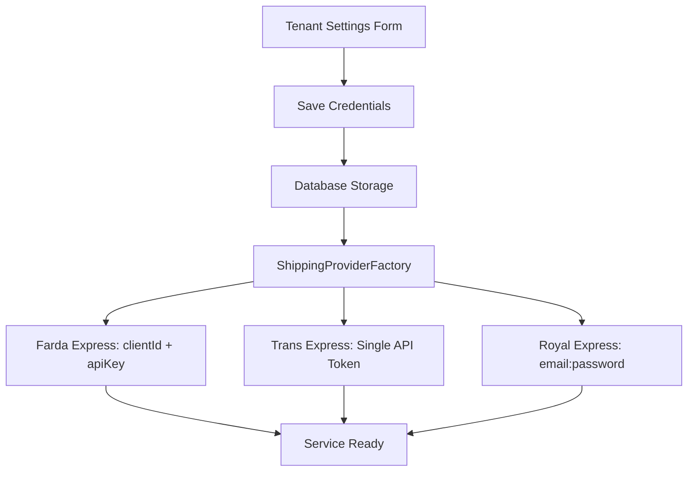

# Courier Service Authentication Alignment Requirements

## 1. Product Overview

Align the multi-tenant project's courier service authentication methods to exactly match the original jnex project implementation. The current multi-tenant project has incorrect authentication configurations that need to be corrected to ensure proper integration with all three courier services.

## 2. Core Features

### 2.1 Authentication Method Corrections

Based on the review of the original jnex project, the following authentication methods need to be implemented:

| Courier Service | Original jnex Authentication          | Current Multi-tenant (Incorrect) | Required Changes                |
| --------------- | ------------------------------------- | -------------------------------- | ------------------------------- |
| Farda Express   | clientId + apiKey (separate fields)   | clientId + apiKey ✓              | No changes needed               |
| Trans Express   | Single API token                      | username + password ❌            | Change to single API token      |
| Royal Express   | email:password format in single field | email + password split ❌         | Change to email:password format |

### 2.2 Feature Module

Our courier authentication alignment consists of the following main components:

1. **Database Schema Updates**: Modify tenant API key fields to match original authentication methods
2. **Service Implementation Updates**: Update constructor and authentication logic for Trans Express and Royal Express
3. **Factory Configuration**: Update ShippingProviderFactory to use correct authentication parameters
4. **UI Form Updates**: Modify settings forms to collect correct authentication credentials
5. **Migration Scripts**: Create database migration to update existing tenant configurations

### 2.3 Page Details

| Component       | Module Name             | Feature Description                                                                                                                           |
| --------------- | ----------------------- | --------------------------------------------------------------------------------------------------------------------------------------------- |
| Database Schema | Tenant Model            | Update transExpressUsername/transExpressPassword to single transExpressApiKey field. Update royalExpressApiKey to store email:password format |
| Service Classes | Trans Express Provider  | Modify constructor to accept single API token instead of username/password                                                                    |
| Service Classes | Royal Express Provider  | Modify constructor to accept email:password format and parse internally                                                                       |
| Factory         | ShippingProviderFactory | Update initialization logic to use correct authentication parameters                                                                          |
| UI Forms        | Settings Form           | Update form fields to match new authentication requirements                                                                                   |
| API Routes      | Tenant Settings         | Update API endpoints to handle new authentication field structure                                                                             |

## 3. Core Process

### Authentication Flow Updates

1. **Tenant Configuration**: Admin configures courier credentials in settings
2. **Credential Storage**: System stores credentials in correct format per service
3. **Service Initialization**: Factory creates service instances with proper authentication
4. **API Communication**: Services authenticate using correct methods



## 4. User Interface Design

### 4.1 Design Style

* Maintain existing form styling and layout

* Use clear field labels to indicate authentication method

* Add helper text explaining credential format requirements

* Primary color: Existing theme colors

* Form validation for credential format

### 4.2 Page Design Overview

| Page Name     | Module Name           | UI Elements                                                                        |
| ------------- | --------------------- | ---------------------------------------------------------------------------------- |
| Settings Form | Farda Express Section | Two separate fields: Client ID and API Key (no changes)                            |
| Settings Form | Trans Express Section | Single field: API Token (replace username/password fields)                         |
| Settings Form | Royal Express Section | Single field: Email:Password (replace separate email field, remove password field) |

### 4.3 Responsiveness

Maintain existing responsive design patterns. Forms should work on desktop and mobile devices with proper field sizing and validation feedback.

## 5. Technical Implementation Details

### 5.1 Database Schema Changes

**Remove fields:**

* `transExpressUsername`

* `transExpressPassword`

**Add field:**

* `transExpressApiKey` (String, optional)

**Modify field:**

* `royalExpressApiKey` should store format: "email:password"

### 5.2 Service Constructor Updates

**Trans Express:**

```typescript
// Current (incorrect)
constructor(username: string, password: string)

// Required (correct)
constructor(apiKey: string)
```

**Royal Express:**

```typescript
// Current (incorrect)
constructor(email: string, password: string, tenant?: string)

// Required (correct)
constructor(apiKey: string, tenant?: string) {
  const [email, password] = apiKey.split(':');
  // ... rest of implementation
}
```

### 5.3 Factory Updates

```typescript
// Trans Express initialization
if (tenantApiKeys.transExpressApiKey) {
  this.providers.set(
    'trans_express',
    new TransExpressProvider(tenantApiKeys.transExpressApiKey)
  );
}

// Royal Express initialization  
if (tenantApiKeys.royalExpressApiKey) {
  this.providers.set(
    'royal_express',
    new RoyalExpressProvider(tenantApiKeys.royalExpressApiKey)
  );
}
```

## 6. Migration Strategy

1. **Database Migration**: Create migration to add new fields and migrate existing data
2. **Backward Compatibility**: Ensure existing shipments continue to work during transition
3. **Data Migration**: Convert existing username/password combinations to appropriate formats
4. **Testing**: Verify all three courier services work with new authentication methods

## 7. Success Criteria

* [ ] Database schema matches original jnex project authentication structure

* [ ] All three courier services authenticate successfully with correct methods

* [ ] Settings form collects credentials in correct format

* [ ] Factory initializes services with proper authentication parameters

* [ ] Existing tenant configurations are migrated successfully

* [ ] All courier service functionality (create shipment, track, get rates) works correctly

* [ ] UI provides clear guidance on credential format requirements

