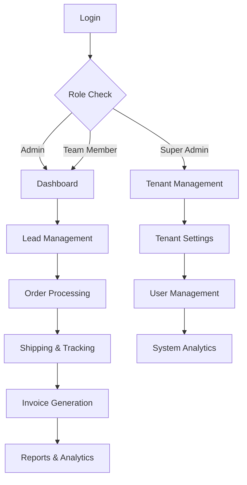

# Multi-Tenant Sales Management System - Production Testing Requirements

## 1. Product Overview

A comprehensive multi-tenant sales management system built with Next.js that handles lead management from Facebook ads, order processing, inventory management, shipping integration with multiple providers, and role-based access control across different tenant organizations.

The system serves businesses that need to manage sales operations across multiple tenants with features like QR code-based returns, invoice generation, tracking updates, and comprehensive reporting capabilities.

## 2. Core Features

### 2.1 User Roles

| Role | Registration Method | Core Permissions |
|------|---------------------|------------------|
| Super Admin | System-level access | Manage all tenants, users, and system settings |
| Admin | Tenant-level admin access | Full tenant management, user creation, settings |
| Team Member | Invited by admin | Lead management, order processing, basic operations |

### 2.2 Feature Module

Our multi-tenant sales management system consists of the following main pages:

1. **Dashboard**: Analytics overview, key metrics, recent activities, tenant-specific data
2. **Lead Management**: Lead import from CSV, lead assignment, status tracking, conversion to orders
3. **Order Management**: Order creation, status updates, shipping integration, invoice generation
4. **Product Management**: Product catalog, inventory tracking, stock adjustments, low stock alerts
5. **Shipping Management**: Multiple provider integration, tracking updates, delivery management
6. **User Management**: User creation, role assignment, permissions, tenant access control
7. **Reports & Analytics**: Sales reports, inventory reports, shipping analytics, tenant performance

### 2.3 Page Details

| Page Name | Module Name | Feature description |
|-----------|-------------|---------------------|
| Dashboard | Analytics Overview | Display key metrics, sales charts, recent orders, low stock alerts, tenant-specific KPIs |
| Dashboard | Quick Actions | Create new lead, process order, adjust inventory, view reports |
| Lead Management | Lead Import | Upload CSV files, map fields, validate data, bulk import leads |
| Lead Management | Lead Assignment | Assign leads to team members, track assignment history, workload distribution |
| Lead Management | Status Tracking | Update lead status (pending, confirmed, no answer, rejected), conversion tracking |
| Order Management | Order Creation | Convert leads to orders, customer information capture, product selection |
| Order Management | Order Processing | Update order status, shipping provider selection, tracking number assignment |
| Order Management | Invoice Generation | Generate PDF invoices with QR codes, print functionality, invoice tracking |
| Product Management | Product Catalog | Add/edit products, manage product codes, pricing, descriptions |
| Product Management | Inventory Control | Real-time stock tracking, stock adjustments, low stock alerts |
| Product Management | Bulk Operations | Import products via CSV, bulk price updates, bulk status changes |
| Shipping Management | Provider Integration | Farda Express, Trans Express, Royal Express API integration |
| Shipping Management | Tracking Updates | Automated tracking updates, delivery status, location tracking |
| Shipping Management | Returns Processing | QR code-based returns, return status tracking, inventory updates |
| User Management | User Administration | Create users, assign roles, manage permissions, tenant access |
| User Management | Authentication | Secure login, session management, password reset |
| Reports & Analytics | Sales Reports | Revenue analytics, order trends, conversion rates, performance metrics |
| Reports & Analytics | Inventory Reports | Stock levels, movement history, low stock alerts, adjustment logs |
| Reports & Analytics | Shipping Analytics | Delivery performance, provider comparison, tracking efficiency |

## 3. Core Process

### Admin Flow
1. Admin logs into tenant-specific dashboard
2. Imports leads from Facebook ads CSV files
3. Assigns leads to team members based on workload
4. Monitors team performance and conversion rates
5. Manages product catalog and inventory levels
6. Configures shipping providers and API keys
7. Generates reports and analytics

### Team Member Flow
1. Team member logs in and views assigned leads
2. Contacts customers and updates lead status
3. Converts confirmed leads to orders
4. Processes orders with customer information
5. Selects shipping provider and generates invoices
6. Tracks order fulfillment and delivery
7. Handles returns using QR code system

### Super Admin Flow
1. Super admin manages multiple tenants
2. Creates new tenant organizations
3. Configures tenant-specific settings and branding
4. Manages tenant referral system
5. Monitors system-wide performance
6. Handles tenant billing and subscriptions

## 4. User Interface Design

### 4.1 Design Style
- **Primary Colors**: Blue (#3B82F6), Green (#10B981) for success states
- **Secondary Colors**: Gray (#6B7280) for text, Red (#EF4444) for errors
- **Button Style**: Rounded corners with hover effects, gradient backgrounds
- **Font**: Inter or system fonts, 14px base size, 16px for headings
- **Layout Style**: Card-based design with clean spacing, top navigation with sidebar
- **Icons**: Heroicons for consistency, Lucide React for additional icons

### 4.2 Page Design Overview

| Page Name | Module Name | UI Elements |
|-----------|-------------|-------------|
| Dashboard | Analytics Cards | Gradient cards with icons, chart.js integration, responsive grid layout |
| Dashboard | Quick Actions | Floating action buttons, modal dialogs, toast notifications |
| Lead Management | Data Tables | Sortable columns, pagination, search filters, bulk actions |
| Lead Management | Import Interface | Drag-drop file upload, progress indicators, validation feedback |
| Order Management | Order Forms | Multi-step forms, auto-complete fields, validation states |
| Order Management | Status Timeline | Progress indicators, status badges, timeline components |
| Product Management | Product Grid | Card layout with images, quick edit modals, bulk selection |
| Shipping Management | Provider Cards | API status indicators, configuration panels, tracking displays |
| Reports & Analytics | Chart Displays | Interactive charts, date range pickers, export buttons |

### 4.3 Responsiveness
The application is mobile-adaptive with desktop-first design, featuring touch-optimized interactions for mobile devices, collapsible sidebar navigation, and responsive data tables with horizontal scrolling.

## 5. Testing Requirements

### 5.1 Authentication & Authorization Testing
- Test login/logout functionality for all user roles
- Verify role-based access control and permissions
- Test session management and timeout handling
- Verify tenant isolation and data security

### 5.2 Lead Management Testing
- Test CSV import functionality with various file formats
- Verify lead assignment and workload distribution
- Test lead status updates and conversion tracking
- Validate data integrity and error handling

### 5.3 Order Processing Testing
- Test order creation from leads
- Verify customer information validation
- Test order status workflow transitions
- Validate inventory updates on order creation

### 5.4 Shipping Integration Testing
- Test all shipping provider APIs (Farda, Trans, Royal Express)
- Verify tracking number generation and updates
- Test automated tracking status updates
- Validate shipping cost calculations

### 5.5 Inventory Management Testing
- Test stock adjustment functionality
- Verify low stock alert system
- Test bulk product operations
- Validate inventory reporting accuracy

### 5.6 Multi-Tenancy Testing
- Verify tenant data isolation
- Test tenant-specific configurations
- Validate tenant referral system
- Test tenant branding and customization

### 5.7 Performance Testing
- Load testing with multiple concurrent users
- Database query optimization verification
- API response time testing
- File upload performance testing

### 5.8 Security Testing
- SQL injection prevention testing
- XSS vulnerability testing
- Authentication bypass testing
- Data encryption verification

## 6. Production Readiness Checklist

### 6.1 Environment Configuration
- [ ] Production database setup and migration
- [ ] Environment variables configuration
- [ ] SSL certificate installation
- [ ] Domain configuration and DNS setup

### 6.2 Security Hardening
- [ ] API rate limiting implementation
- [ ] CORS configuration
- [ ] Security headers setup
- [ ] Input validation and sanitization

### 6.3 Performance Optimization
- [ ] Database indexing optimization
- [ ] Image optimization and CDN setup
- [ ] Caching strategy implementation
- [ ] Bundle size optimization

### 6.4 Monitoring & Logging
- [ ] Error tracking setup (Sentry)
- [ ] Performance monitoring
- [ ] Database monitoring
- [ ] API endpoint monitoring

### 6.5 Backup & Recovery
- [ ] Database backup strategy
- [ ] File storage backup
- [ ] Disaster recovery plan
- [ ] Data retention policies

### 6.6 Documentation
- [ ] API documentation
- [ ] User manual creation
- [ ] Admin guide documentation
- [ ] Deployment documentation

## 7. Testing Scenarios

### 7.1 Critical Path Testing
1. **Lead to Order Conversion**: Import leads → Assign → Contact → Convert → Process → Ship
2. **Inventory Management**: Add products → Track stock → Process orders → Adjust inventory
3. **Multi-tenant Operations**: Create tenant → Add users → Configure settings → Process orders

### 7.2 Edge Case Testing
- Large CSV file imports (>10,000 records)
- Concurrent user operations on same data
- Network failure during API calls
- Invalid shipping provider responses
- Database connection failures

### 7.3 Integration Testing
- Shipping provider API integration
- Email notification system
- PDF generation and printing
- QR code generation and scanning
- Database transaction integrity

## 8. Deployment Strategy

### 8.1 Staging Environment
- Mirror production configuration
- Test all integrations
- Performance testing
- User acceptance testing

### 8.2 Production Deployment
- Blue-green deployment strategy
- Database migration execution
- Environment variable updates
- DNS cutover and monitoring

### 8.3 Post-Deployment Monitoring
- Application health checks
- Database performance monitoring
- User activity monitoring
- Error rate tracking

This comprehensive testing plan ensures all major features are thoroughly tested and the system is production-ready with proper monitoring, security, and performance optimizations.